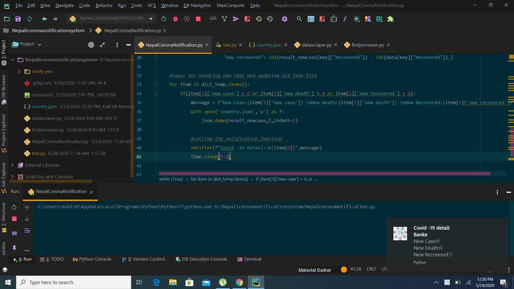

# CoronaNotificationSystem
<strong>why this project?</strong>
I spend most of the time using my laptop during this lockdown period. I can only get to know about new cases whenever i am using social media.
Keeping these things, I created a notification system that notifies you whenever any new case appears in Nepal. Now I can do my other projects or watch movies and get notified about new updates.

# Requirements

beautifulsoup4	4.9.1

certifi	2020.4.5.1

chardet	3.0.4
	

idna	2.9
	

lxml	4.5.1
	

pip	19.0.3
	

plyer	1.4.3
	

requests	2.23.0

setuptools	40.8.0

soupsieve	2.0.1

urllib3	1.25.9

# Description 
   <strong>datascraper.py</strong> consist of function that load and scrapped "https://kathmandupost.com/covid19" then in return gives the dictionary data which is
   saved as  json file. 
  
 <strong>firstjsonsaver.py</strong> is the first program to save the json file as "country.json". 
 
note:either run this file once or don't run it. It's okay if you don't run it.

  
 <strong>NepalCoronaNotification.py</strong> is the main program that notifies me whenever new updates are obtained.Also the logic for handling new case and updating old json file
 is done.
 
 #Run
 1.clone or download this project:"https://github.com/Aasess/CoronaNotificationSystem.git"
  
 2.run firstjsonsaver.py(optional)
  
 3.run NepalCoronaNotication.py 