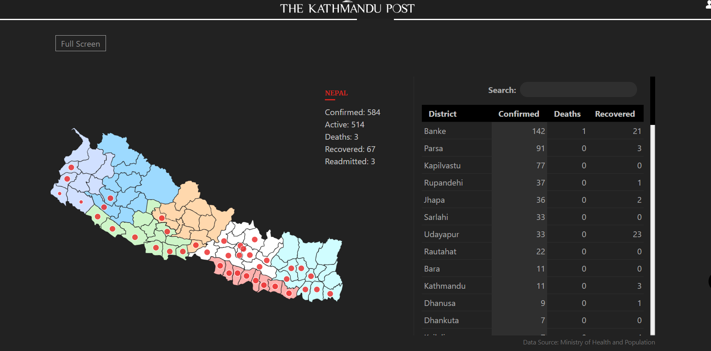

# CoronaNotificationSystem
<strong>*pics of original image*</strong>

  
<strong>why this project?</strong>
I spend most of the time using my laptop during this lockdown period. I can only get to know about new cases whenever i am using social media.
Keeping these things, I created a notification system that notifies me whenever any new case appears in Nepal. Now I can do my other projects or watch movies and get notified about new updates.

# Description 
   <strong>datascraper.py</strong> consist of function that load and scrapped "https://kathmandupost.com/covid19" then in return gives the dictionary data which is
   saved as  json file. 
  
 <strong>firstjsonsaver.py</strong> is the first program to save the json file as "country.json". 
 
note:either run this file once or don't run it. It's okay if you don't run it.

  
 <strong>NepalCoronaNotification.py</strong> is the main program that notifies me whenever new updates are obtained.Also the logic for handling new case and updating old json file
 is done.
 
 # Run
 1.clone or download this project:
 <pre>git clone https://github.com/Aasess/CoronaNotificationSystem.git</pre>
 
 2.Create your virtual env
 <pre>python3 -m venv virtualenv</pre>
 
 3.activate your env and install all requirements
 <pre>virtualenv\Scripts\activate.bat</pre>
 <pre>pip install -r /path/to/requirements.txt</pre>
 
 4.run firstjsonsaver.py(optional)
 
 5.run NepalCoronaNotication.py (it runs infinity and notifies you if new cases appear).
